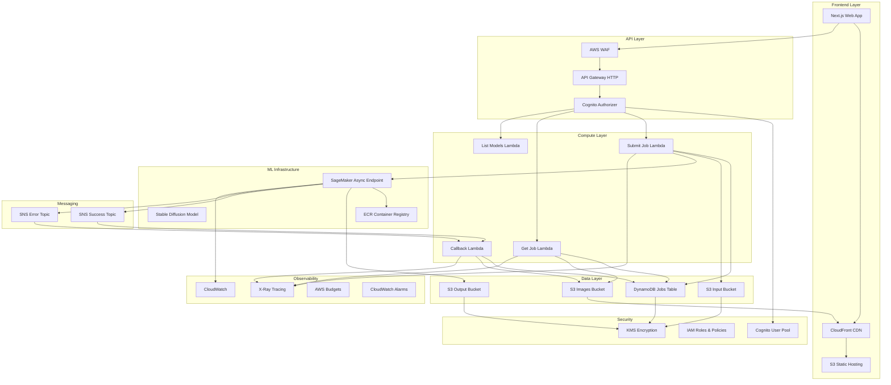

# Architecture Documentation

## Overview

The AWS Image Generation Platform is a production-ready, cost-optimized system for AI-powered image generation using Stable Diffusion models. The architecture follows AWS best practices with scale-to-zero capabilities, comprehensive observability, and robust security.

## High-Level Architecture



## Component Details

### Frontend Layer

#### Next.js Web Application
- **Technology**: Next.js 14+ with TypeScript
- **Deployment**: Static export to S3 with CloudFront distribution
- **Features**:
  - Server-side rendering for SEO
  - Progressive Web App capabilities
  - Responsive design with Tailwind CSS
  - Real-time job status updates
  - Image gallery and management

#### CloudFront CDN
- **Purpose**: Global content delivery and caching
- **Features**:
  - HTTPS termination with custom SSL certificates
  - Origin Access Control (OAC) for S3 security
  - Custom error pages and redirects
  - Compression and optimization

### API Layer

#### API Gateway HTTP API
- **Type**: HTTP API (lower latency and cost vs REST API)
- **Features**:
  - JWT authorization with Cognito
  - CORS configuration
  - Request/response transformation
  - Throttling and rate limiting

#### AWS WAF
- **Protection**: Layer 7 DDoS protection and filtering
- **Rules**:
  - Rate limiting (configurable per environment)
  - AWS Managed Core Rule Set
  - Custom rules for application-specific threats

### Compute Layer

#### Lambda Functions

**Submit Job Lambda**
- **Runtime**: Node.js 20 with TypeScript
- **Purpose**: Validate requests and initiate SageMaker inference
- **Features**:
  - Input validation with Zod schemas
  - Support for both sync and async modes
  - Job persistence in DynamoDB
  - Error handling and retry logic

**Get Job Lambda**
- **Runtime**: Node.js 20 with TypeScript
- **Purpose**: Retrieve job status and results
- **Features**:
  - User authorization checks
  - Presigned URL generation for images
  - Status polling optimization

**List Models Lambda**
- **Runtime**: Node.js 20 with TypeScript
- **Purpose**: Provide available model information
- **Features**:
  - Model metadata and capabilities
  - User-specific filtering
  - Caching headers for performance

**Callback Lambda**
- **Runtime**: Node.js 20 with TypeScript
- **Purpose**: Process SageMaker async results
- **Features**:
  - SNS message processing
  - Image processing and storage
  - Job status updates

### ML Infrastructure

#### SageMaker Async Inference
- **Mode**: Asynchronous with scale-to-zero
- **Instance Types**: GPU instances (ml.g5.xlarge default)
- **Features**:
  - Auto-scaling from 0 to N instances
  - S3-based input/output handling
  - SNS notifications for completion
  - Custom container support

#### Model Container
- **Base**: NVIDIA CUDA with PyTorch
- **Model**: Stable Diffusion XL (configurable)
- **Features**:
  - Optimized inference pipeline
  - Memory management for GPU efficiency
  - Comprehensive error handling
  - Metadata generation

### Data Layer

#### DynamoDB
- **Table**: Jobs table with GSIs
- **Features**:
  - Pay-per-request billing
  - Point-in-time recovery
  - Encryption at rest with KMS
  - TTL for automatic cleanup

**Schema**:
```json
{
  "jobId": "string (PK)",
  "userId": "string (GSI)",
  "status": "string (GSI)",
  "createdAt": "string",
  "updatedAt": "string",
  "inputParams": "object",
  "imageUrl": "string",
  "metadata": "string",
  "ttl": "number"
}
```

#### S3 Buckets

**Input Bucket**
- **Purpose**: Store inference input JSON files
- **Lifecycle**: Delete after 30 days
- **Access**: SageMaker execution role only

**Output Bucket**
- **Purpose**: Store raw SageMaker outputs
- **Lifecycle**: IA after 30 days, Glacier after 90 days
- **Access**: SageMaker and callback Lambda

**Images Bucket**
- **Purpose**: Store processed images for public access
- **Lifecycle**: IA after 30 days (no deletion)
- **Access**: Public read via CloudFront OAC

### Security

#### Identity and Access Management
- **Principle**: Least privilege access
- **Implementation**:
  - Service-specific IAM roles
  - Resource-based policies
  - Cross-service permissions

#### Encryption
- **At Rest**: KMS encryption for S3 and DynamoDB
- **In Transit**: TLS 1.2+ for all communications
- **Keys**: Customer-managed KMS keys with rotation

#### Authentication
- **Service**: Amazon Cognito User Pools
- **Features**:
  - Email/password authentication
  - JWT token-based API access
  - MFA support (optional)
  - OAuth 2.0 flows

### Observability

#### Monitoring
- **CloudWatch Metrics**: Custom and service metrics
- **CloudWatch Logs**: Structured logging with retention
- **X-Ray Tracing**: End-to-end request tracing
- **Dashboards**: Real-time operational visibility

#### Alerting
- **CloudWatch Alarms**: Error rates, latency, costs
- **SNS Notifications**: Email and SMS alerts
- **Budget Alerts**: Cost monitoring and controls

## Data Flow

### Image Generation Flow (Async)

1. **User Request**
   - User submits prompt via web interface
   - Frontend validates input and calls API

2. **API Processing**
   - API Gateway authenticates request
   - Submit Job Lambda validates parameters
   - Job record created in DynamoDB

3. **Inference Initiation**
   - Input JSON uploaded to S3
   - SageMaker async endpoint invoked
   - Lambda returns job ID to user

4. **Model Processing**
   - SageMaker scales up GPU instance (cold start ~60s)
   - Model loads and processes request
   - Generated image and metadata saved to S3

5. **Result Processing**
   - SNS notification triggers callback Lambda
   - Image processed and moved to public bucket
   - Job status updated in DynamoDB

6. **User Retrieval**
   - User polls job status via API
   - Completed job returns image URL
   - Image served via CloudFront CDN

### Cost Optimization Flow

1. **Scale-to-Zero**
   - SageMaker instances terminate after idle period
   - No compute costs when not generating images

2. **Storage Lifecycle**
   - Automatic transition to cheaper storage classes
   - Cleanup of temporary files

3. **Budget Monitoring**
   - Real-time cost tracking
   - Automated alerts at thresholds
   - Anomaly detection for unusual spending

## Deployment Architecture

### Environments

**Development (dev)**
- Single AZ deployment
- Smaller instance types
- Shorter retention periods
- Relaxed security for testing

**Staging (stage)**
- Production-like configuration
- Full security implementation
- Performance testing environment

**Production (prod)**
- Multi-AZ deployment
- Production instance types
- Full observability and alerting
- Maximum security hardening

### Infrastructure as Code

**Terraform Modules**:
- `network`: VPC, subnets, security groups
- `data`: S3 buckets, DynamoDB tables, KMS
- `auth`: Cognito user pools and identity pools
- `sagemaker`: ML infrastructure and endpoints
- `api`: API Gateway and Lambda functions
- `callbacks`: SNS topics and processing
- `frontend`: S3 hosting and CloudFront
- `observability`: Monitoring and alerting

### CI/CD Pipeline

**Infrastructure Pipeline**:
1. Terraform plan on PR
2. Manual approval for apply
3. Environment-specific deployments

**Application Pipeline**:
1. Lint, test, and build
2. Deploy Lambda functions
3. Deploy frontend to S3
4. Run E2E tests

## Performance Characteristics

### Latency
- **Cold Start**: ~60 seconds (first request)
- **Warm Instance**: 5-20 seconds (subsequent requests)
- **API Response**: <100ms (status checks)

### Throughput
- **Concurrent Jobs**: 10 per instance (configurable)
- **Auto-scaling**: 0 to N instances based on demand
- **Queue Depth**: Unlimited (S3-based)

### Availability
- **Target SLA**: 99.9% uptime
- **Multi-AZ**: Automatic failover
- **Graceful Degradation**: Queue requests during scaling

## Security Considerations

### Threat Model
- **Data Privacy**: User prompts and generated images
- **Cost Control**: Preventing runaway inference costs
- **Access Control**: User isolation and authorization

### Mitigations
- **Encryption**: End-to-end encryption of sensitive data
- **Rate Limiting**: API and inference throttling
- **Input Validation**: Comprehensive parameter checking
- **Monitoring**: Real-time security event detection

## Operational Procedures

### Deployment
1. Infrastructure changes via Terraform
2. Application deployments via CI/CD
3. Blue-green deployments for zero downtime

### Monitoring
1. Real-time dashboards for key metrics
2. Automated alerting for anomalies
3. Regular cost and performance reviews

### Incident Response
1. Automated detection and alerting
2. Runbook-driven response procedures
3. Post-incident analysis and improvements

### Backup and Recovery
1. Point-in-time recovery for DynamoDB
2. Cross-region replication for critical data
3. Infrastructure recreation via Terraform

This architecture provides a robust, scalable, and cost-effective platform for AI image generation while maintaining high security and operational standards.