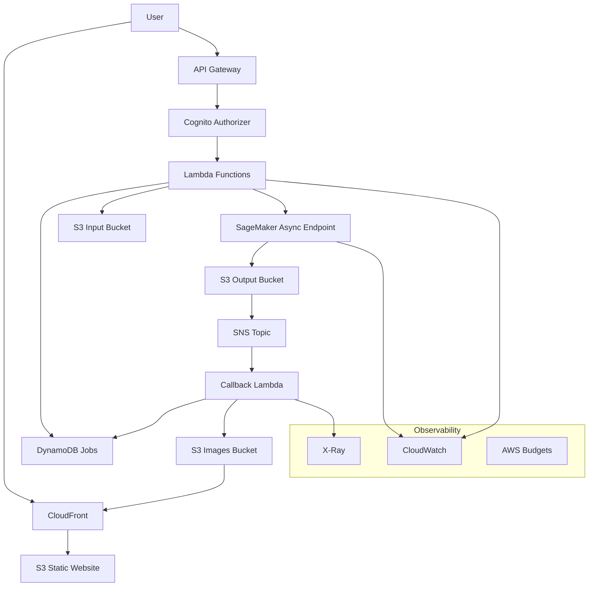

# AWS Image Generation Platform

A production-ready, cost-optimized image generation platform built on AWS with SageMaker asynchronous inference, scale-to-zero capabilities, and comprehensive observability.

## Architecture



## Features

- **Scale-to-Zero**: SageMaker async inference with automatic scaling (0-N instances)
- **Cost Optimized**: GPU instances only run when needed, comprehensive cost controls
- **Production Ready**: Full observability, security, CI/CD, and error handling
- **Multi-Model Support**: Configurable Stable Diffusion models via SageMaker JumpStart
- **Real-time Option**: Optional always-on endpoint for low-latency use cases
- **Secure**: IAM least-privilege, KMS encryption, WAF protection

## Quick Start

### Prerequisites

- AWS CLI configured with appropriate permissions
- Terraform >= 1.8
- Node.js >= 20
- Docker
- Make

### 1. Bootstrap Infrastructure

```bash
# Clone and setup
git clone <repo-url>
cd obvy
make bootstrap

# Configure environment
cp dev/.env.example dev/.env.dev
# Edit dev/.env.dev with your settings

# Initialize Terraform
make tf-init ENV=dev

# Plan and apply infrastructure
make tf-plan ENV=dev
make tf-apply ENV=dev
```

### 2. Deploy Services

```bash
# Build and deploy model container (if using custom model)
make model-build
make model-push ENV=dev

# Deploy API services
make deploy-api ENV=dev

# Deploy frontend
make deploy-frontend ENV=dev
```

### 3. Access the Application

After deployment, the outputs will show:
- **Frontend URL**: `https://<cloudfront-domain>`
- **API Base URL**: `https://<api-gateway-domain>/v1`

## Usage

### Basic Image Generation Flow

1. **Submit Job**: `POST /v1/jobs`
   ```json
   {
     "prompt": "A beautiful sunset over mountains",
     "modelId": "stable-diffusion-xl",
     "steps": 20,
     "width": 1024,
     "height": 1024,
     "quality": "high"
   }
   ```

2. **Check Status**: `GET /v1/jobs/{jobId}`
   ```json
   {
     "jobId": "01HXXX...",
     "status": "SUCCEEDED",
     "imageUrl": "https://cdn.example.com/images/...",
     "metadata": { "timings": {...} }
   }
   ```

### Cold Start Behavior

- **First request**: ~60s (model loading + inference)
- **Subsequent requests**: 5-20s (inference only)
- **Auto-scaling**: Scales to zero after 15 minutes of inactivity

## Configuration

### Environment Variables

Key configuration options in `dev/.env.{env}`:

```bash
# Core Settings
AWS_REGION=us-east-1
PROJECT_NAME=obvy-imggen
ENVIRONMENT=dev

# SageMaker Configuration
SAGEMAKER_MODE=async  # async | realtime
INSTANCE_TYPE_ASYNC=ml.g5.xlarge
INSTANCE_TYPE_REALTIME=ml.g5.xlarge
MAX_CONCURRENCY=10
INFERENCE_TIMEOUT=300

# Model Configuration
USE_JUMPSTART=true
JUMPSTART_MODEL_ID=huggingface-txt2img-stable-diffusion-xl-base-1-0
# OR for custom model:
# USE_JUMPSTART=false
# ECR_REPOSITORY_URI=123456789012.dkr.ecr.us-east-1.amazonaws.com/obvy-model

# Cost Controls
MONTHLY_BUDGET_USD=100
ENABLE_KEEP_WARM=false

# Optional: Custom Domain
# DOMAIN_NAME=imggen.example.com
# CERTIFICATE_ARN=arn:aws:acm:...
```

## Cost Management

### Estimated Monthly Costs

| Usage Level | GPU Hours | Storage | Data Transfer | Total |
|-------------|-----------|---------|---------------|-------|
| Light (50 jobs) | $15 | $5 | $2 | ~$22 |
| Medium (500 jobs) | $75 | $15 | $10 | ~$100 |
| Heavy (5000 jobs) | $400 | $50 | $50 | ~$500 |

*Based on ml.g5.xlarge at $1.006/hour, assumes 2-minute average job duration*

### Cost Optimization Features

- **Scale-to-Zero**: No GPU costs when idle
- **S3 Lifecycle**: Automatic transition to IA/Glacier
- **Budget Alerts**: Email notifications at 80%/100% of budget
- **Rate Limiting**: Prevents runaway costs
- **Spot Instances**: Optional for batch processing

## Development

### Local Development

```bash
# Start local development environment
make dev-setup

# Run frontend locally (with API mocks)
cd apps/web
npm run dev

# Run API tests
cd services/api
npm test

# Lint and type check
make lint
make typecheck
```

### Testing

```bash
# Unit tests
make test-unit

# Integration tests
make test-integration

# E2E tests (requires deployed environment)
make test-e2e ENV=dev
```

## Operations

### Monitoring

- **CloudWatch Dashboards**: API metrics, SageMaker performance, cost tracking
- **Alarms**: Error rates, latency thresholds, budget overruns
- **X-Ray Tracing**: End-to-end request tracing

### Troubleshooting

#### Cold Start Issues
```bash
# Check SageMaker endpoint status
aws sagemaker describe-endpoint --endpoint-name obvy-imggen-dev-async

# View endpoint logs
aws logs tail /aws/sagemaker/Endpoints/obvy-imggen-dev-async --follow
```

#### Failed Jobs
```bash
# Check job status in DynamoDB
aws dynamodb get-item --table-name obvy-imggen-dev-jobs --key '{"jobId":{"S":"01HXXX..."}}'

# Check SNS/Lambda callback logs
aws logs tail /aws/lambda/obvy-imggen-dev-callback --follow
```

### Scaling

#### Enable Real-time Mode
```bash
# Update environment configuration
export SAGEMAKER_MODE=realtime
make tf-plan ENV=dev
make tf-apply ENV=dev
```

#### Adjust Instance Types
```bash
# For higher throughput
export INSTANCE_TYPE_ASYNC=ml.g5.2xlarge
export MAX_CONCURRENCY=20
make tf-apply ENV=dev
```

## Security

- **IAM**: Least-privilege roles for all components
- **Encryption**: KMS encryption for S3, DynamoDB encryption at rest
- **Network**: VPC endpoints, private subnets for SageMaker
- **WAF**: Rate limiting, OWASP protection
- **Secrets**: AWS Secrets Manager for sensitive configuration

## Contributing

1. Fork the repository
2. Create a feature branch
3. Make changes with tests
4. Run `make lint && make test`
5. Submit a pull request

## License

MIT License - see LICENSE file for details.

## Support

- **Issues**: GitHub Issues
- **Documentation**: See `/docs` directory
- **Architecture**: See `ARCHITECTURE.md`
- **Costs**: See `COSTS.md`
- **Security**: See `SECURITY.md`